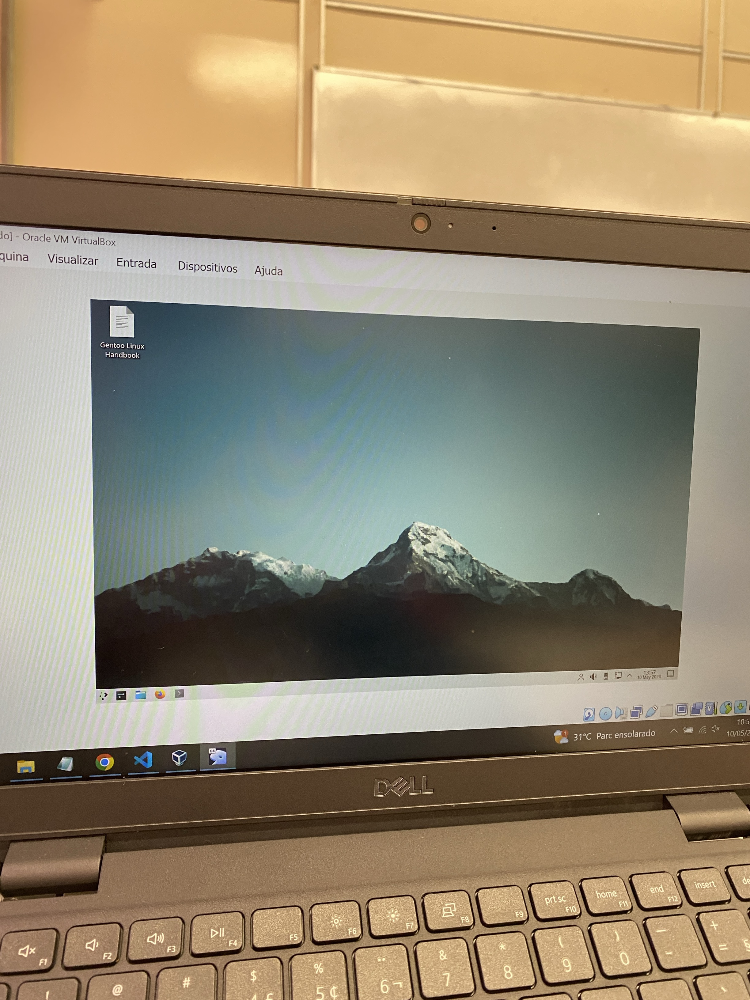

# manual_GENTO-

1-Primeiro passo :  seu professor responsavel deve passar  para voce o arquivo com o gento  e assim voce passa para seu computador baixado ...
    
    2-Segundo passo: voce abre o seu virtual box e configure colocando as seguintes informações 

            -coloque a pasta com seu gento 
            - confirme e coloque a memoria em 4096 ( ou o tanto que seu computador aguente!!!)
            - processador: 2
            - 50 gb ( vai de acordo para seu computador!!)
            - inicie o progama e espere tudo 
            - com o gento instalado voce configure de acordo com seu : indioma,gosto e projetos etc...

     3-ultimo passo: depois de pronto se divirta com seu gento virtual :D

     
